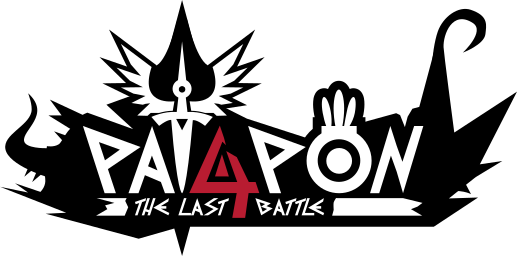

<html>
    

    
    

    <h2 align="center">
    Patapon 4 - The Last Battle
    </h2>
</html>

___
### Welcome!
Patapon 4 The Last Battle (or P4TLB, TLB for short) is a community based project based on the [PATAPON](https://en.wikipedia.org/wiki/Patapon) series originally made by Rolito and Pyramid.

___
### Packages:
This game (also Stormium) use a package system, for a better code maintenance.

-   [Core package](https://github.com/guerro323/package.patapon.core)
-   [Gamebase package](https://github.com/StormiumTeam/package.stormiumteam.gamebase)
-   [Networking package](https://github.com/StormiumTeam/package.stormiumteam.networking)
-   [Shared package](https://github.com/StormiumTeam/package.stormiumteam.shared)
___
### Importants links:

-   [Contributing (or just testing the early development)](CONTRIBUTING.md)

___

<html>
    

    
    

</html>