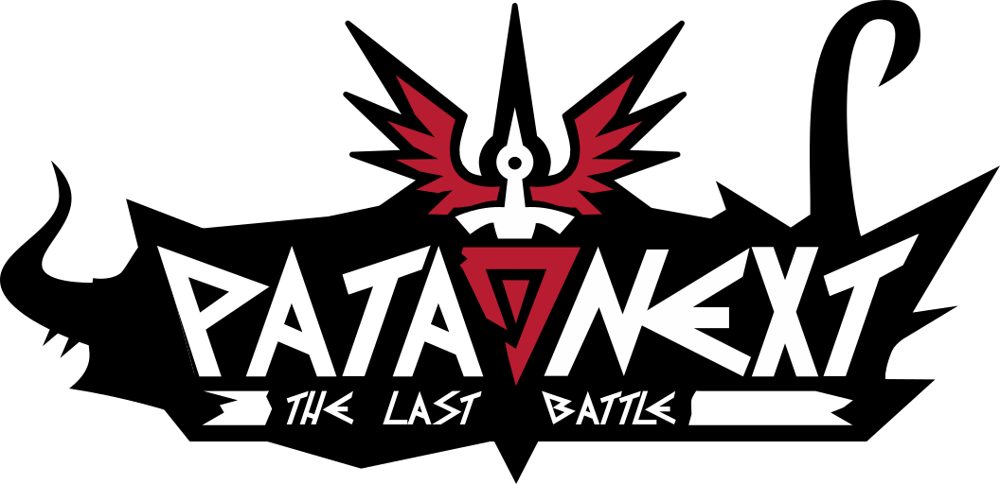

<html>
    

    
    

    <h2 align="center">
    PataNext
    </h2>
</html>

___
### Welcome!
PataNext (also knew as Patapon 4 The Last Battle or P4TLB/TLB) is a community based project based on the [PATAPON](https://en.wikipedia.org/wiki/Patapon) series originally made by Rolito and Pyramid.

___
### Framework:
This game use the framework 'revghost' [(link)](https://github.com/guerro323/revecs) and the ECS library 'revecs' [(link)](https://github.com/guerro323/revecs)

___
### Developping:
**Requirements:**
- .NET 6 SDK
- git
- Godot 3.3

**Project Steps:**
1. Clone the repository
2. Execute `dotnet script update.csx` in the main folder

**Godot Client:**
1. In the main folder run `godot Godot/project/project.godot`
2. This should launch Godot with the respective project.
3. Click on the start icon in Godot to start the project.
4. (FOR NOW: When started, you'll be greeted by the beautiful `icon.png` bouncing around)

It may be possible that you wish to also develop on Quadrum for modifying the core gameplay of PataNext:
1. Clone [Quadrum](https://github.com/guerro323/that-rhythm-project) repository
2. Follow the steps in Quadrum README.md
3. In PataNext project, add the file `PATH` (without extension) in `dependencies/Quadrum` (make sure that the folder was originally empty, and if the folder doesn't exist, create it)
4. Add in the `PATH` file the path to the cloned Quadrum folder.
5. Any change you make in the Quadrum folder will be added in the PataNext project.
6. If you push the changes to this repository that include changed Quadrum content, make sure you do the same in the Quadrum repository.

<html>
    

    
    

</html>
